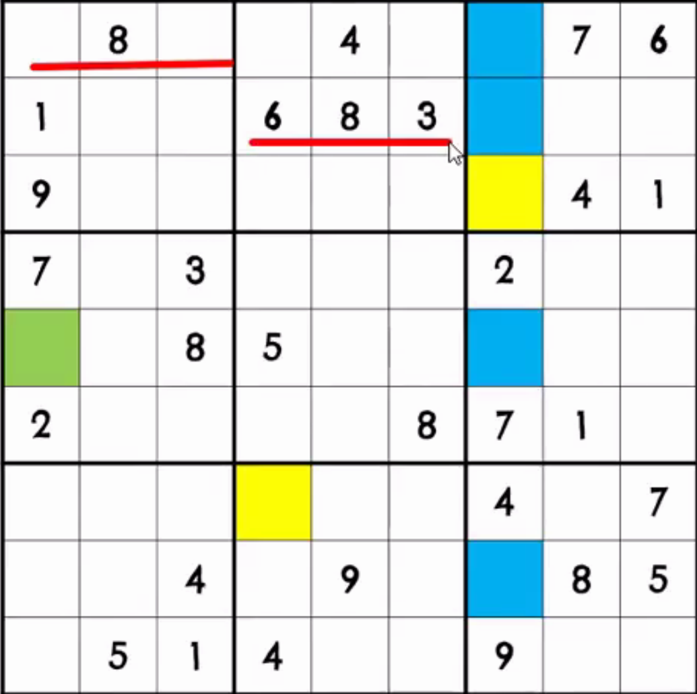
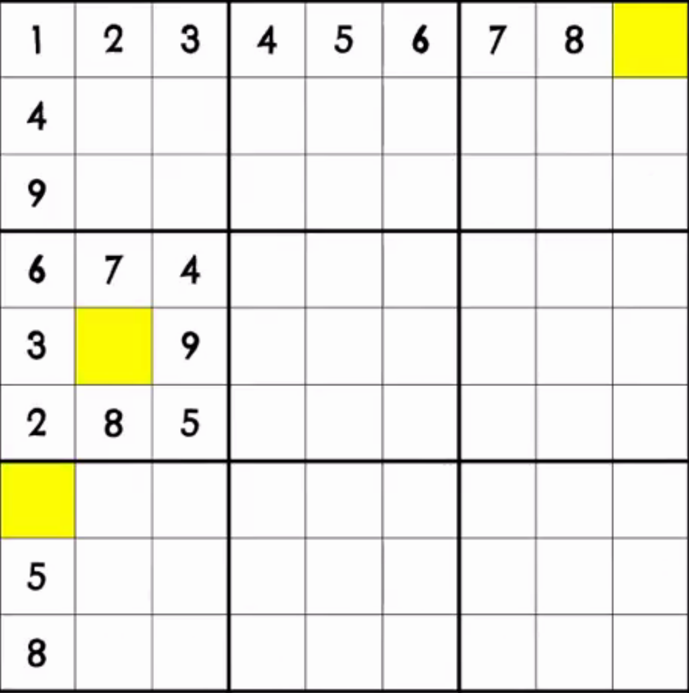
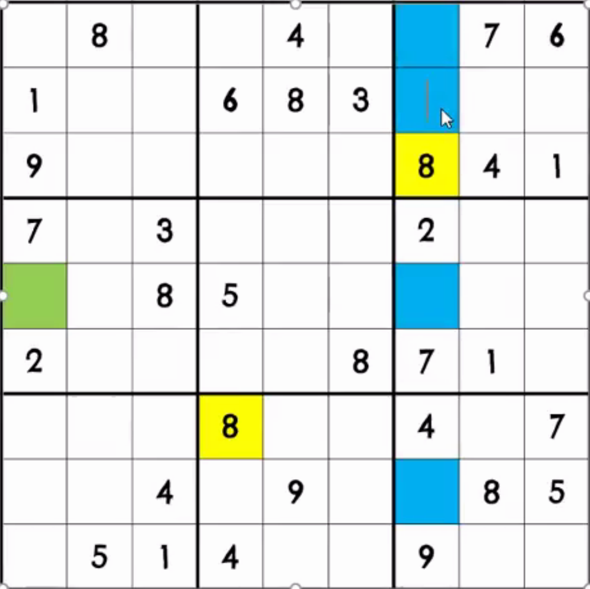
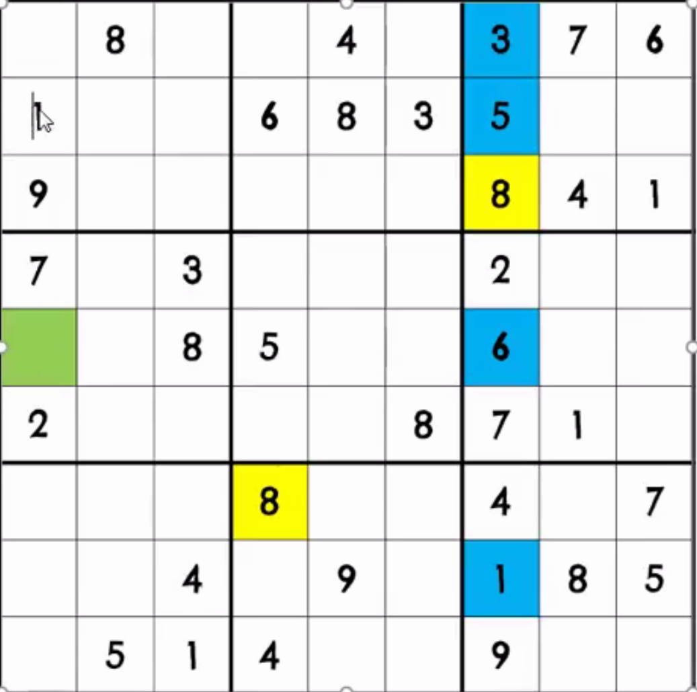

# sudoku_solver
a school project for TPI, a web app that automatcally solves a sudoku
## Tecniche risolutive
-   **slittamento**
se sono presenti 3 riquadri vicini(successivi su riga o colonna) e in 2 di essi è presente lo stesso numero su due colonne diverse, il suddetto numero sarà presente nel terzo riquadro nella colonna mancante

-   **riempimento**:
se in una stessa riga o in una stessa colonna o in uno stesso blocco sono presenti 8 numeri su 9 nella casella mancante andrà il numero mancante

-   **incroci:**
prendere in considerazione una riga o una colonna o un blocco in cui mancano pochi numeri e inserire tutti numeri che mancano

-   **esclusione:**
andando per esclusione si completa una casella controllando quali numeri non sono presenti nella stesso riga o colonna o blocco

